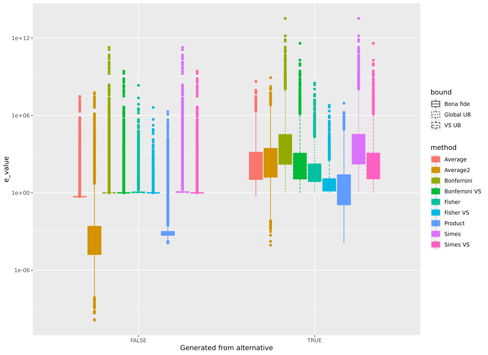

## 

"**E-values: Calibration, combination and applications**" 
Vladimir Vovk and Ruodu Wang

* Hypothesis testing!

* **$e$-values:** An alternative to $p$-values

* **Calibration:** Derive $e$-values from $p$-values and vice versa

* **Combination:** Combine multiple values into one

* **Applications:** Election Auditing!

## What is a $p$-value? Hypothesis?

](./images/unfair_coin_izbiki.bmp)

## What is a $p$-value?
* "$\text{H}_0$: My coin is fair! $P(\text{Heads})=0.5!$"
* I think $\text{H}_1$: $P(\text{Heads}) > 0.5!$
* I flip the coin 10 times
  - I observe 8 heads, 2 tails.
  - `pbinom(2, size = 10, prob = 0.5)` $=0.0546875$!
* This is a really rare result if you're right.
* Statistical anomaly?

. . .

- LIES!

## $p$-values

* The probability we calculated is a $p$-value
* It bounds the probability of the observed event under $\text{H}_0$
* If an event is rare enough, we have reason to doubt $\text{H}_0$
  - Traditionally, we reject $\text{H}_0$ if observed event is rarer than 1/20
  - Significance level $\alpha=.95$

## Why are $p$-values so popular?

* $p$-values are useful!
* Quantifies evidence against the null hypothesis
* Convenient when null distribution is known

## Formally...

* Null probability measure $Q$
* A random variable $0\leq P\leq1$ is a *$p$-variable* if:
 - $\forall \epsilon\in(0,1):\ Q(P \leq \epsilon) \leq \epsilon$
* Values taken by $P$ are called $p$-values
* In textbook stats, this is an equality $\Rightarrow$ uniform

## $e$-values

A random variable $0\leq E\leq \infty$ is an *$e$-variable* if $\mathbb{E}^Q(E)\leq1$

* Betting interpretation:
  - The bookkeeper believes the null-distribution
  - If we take advantage of her, we can make some money
  - $E$ represents our bet
  - $e$ is the amount we have multiplied our initial investment by
* What if we lose money?
  - Evidence *in favour* of null hypothesis

# Combination: Intractibility of $p$

## Repeated experiments

* What if we can't reject null?
  - Do the experiment again?
  - $p$-hacking?? *$e$-hacking*????
* Make sure to adjust!
  - Don't be a hacker!
* But how?

## Multiple testing ($p$-values)

* Fisher's method
* Requires independent $p$-values - no shared data!
* If $p$-values are uniformly distributed under $\text{H}_0$:
  - $-2\text{log}(p_1\cdots p_n) \sim \chi^2(2n)$
  - Combined $p$-value is the $\chi^2$ quantile

## Multiple testing ($e$-values)

* Independent? *Sequential?*
  - Take the product
* Dependent?
  - Take the mean

## Testing multiple hypotheses

* Testing efficacy of a new drug against 100 diseases
* Which diseases can the drug treat?
* Conduct test for 100 hypotheses:
  - $\text{H}_0$: The drug has no effect
  - $\text{H}_1$: The drug effectively treats the disease

## Multiple comparisons problem

* $p$-values are uniformly distributed under $\text{H}_0$
* Even if the drug is always ineffective
 - Expect to reject $\text{H}_0$ $1/\alpha$ times
 - Using $\alpha = 0.05$, expect to find drug effective against 5 diseases
 - Too many *Type I errors*
* $e$-values are not immune either

## What do we do?

* We have a few methods for combining multiple $p$-values into one
  - Holm-Bonferroni correction (no dependence assumption)
  - Simes' (either independent or positively dependent)
  - A bajillion other methods
* Just take the average of $e$-values

## How to adjust per-hypothesis?

* Testing each hypothesis requires one $p$ or $e$ each
* Computationally intensive way:
  - For each hypothesis $\text{H}_i,\ i=1,\dots,n$
  - Check every subset of hypotheses $\{\text{H}_1,\dots,\text{H}_n\}$ containing $\text{H}_i$
  - Use the largest combined $p$-value of these subsets
  - Smallest average $e$-value
* Computational shortcuts can approximate in $\mathcal{O}(n^2)$ time

# Calibration: $p$-to-$e$ and $e$-to-$p$

## $e$-to-$p$ Calibration

* $e$-variables are nonnegative
* Markov's inequality:
  - $\Rightarrow Q(E \geq a) \leq \frac{1}{a}$, for any $a>0$
  - $\Rightarrow Q(\frac{1}{E} \leq \frac{1}{a}) \leq \frac{1}{a}$
  - $\Rightarrow Q(\frac{1}{E} \leq \epsilon) \leq \epsilon$, for $\epsilon>0$.
* So we can transform $e \rightarrow min(1, 1/e)$

## $p$-to-$e$ Calibration

* Not quite as easy as $1/p$.
* The family of functions $f_\kappa(p) = \kappa p^{\kappa - 1}$ work for $\kappa \in (0,1)$.
  - Upper bound has a closed form: $VS(p) = max_\kappa f_\kappa(p) = max(1, \frac{-1}{e p log(p)})$
* Integrate over $\kappa$: $F(p) = \int_0^1\kappa p^{\kappa-1} d\kappa = \frac{1 - p + p log(p)}{p(log(p))^2}$.
* Possibly many more...

# Experimental results

## Multiple tests, single hypothesis

## Multiple tests, single hypothesis

## Multiple tests, single hypothesis

## Multiple hypotheses

## Multiple hypotheses

## Multiple hypotheses

# Statistical Election Auditing

## Post-election audits

- An election has taken place
- Officials report that candidate $w\in C$ has won
- Want to verify that no other candidate $c \in C$ should have won

## A hypothesis test

- $\text{H}_0$: The reported outcome is incorrect
- $\text{H}_1$: The reported outcome is correct

. . .

- Composite null: one hypothesis $\text{H}_{0,c}$ for each $c\in C\setminus\{w\}$
  * $\text{H}_{0,c}$: Candidate $c$ should have won
